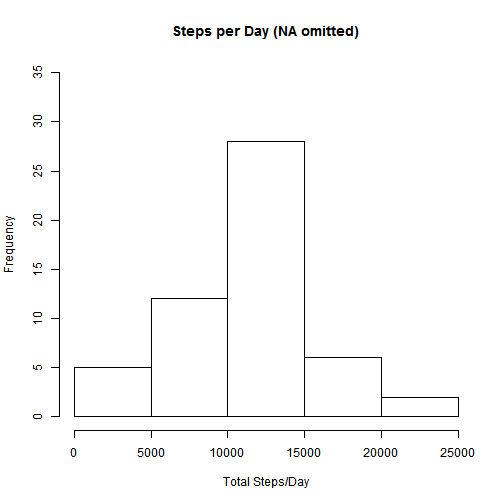
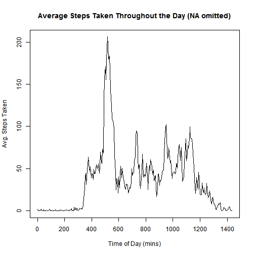
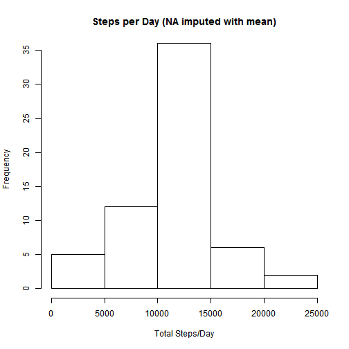
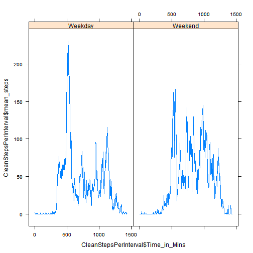

## Loading and preprocessing the data
In the initial stage, no special processing was needed.  It was sufficienct to read the data. Processing to perform the individual tasks was performed just before the analysis.    

```r
# Read the raw data
ActData<-read.csv("activity.csv")
```


## What is mean total number of steps taken per day?
New dataframes are used at various times for differnt processing activities.  The first summarizes the total steps taken each day.  The summary was created by aggregating the step by date.

```r
# New df for daily summary
StepsPerDay<-aggregate(ActData$steps~ActData$date,FUN=sum)
colnames(StepsPerDay)<-c("date","steps")

# Summarize daily steps in a histogram and with summary statistics
hist(StepsPerDay$steps,xlab="Total Steps/Day",main="Steps per Day (NA omitted)",ylim=c(0,35))
```

 

```r
mean(StepsPerDay$steps)
```

```
## [1] 10766.19
```

```r
median(StepsPerDay$steps)
```

```
## [1] 10765
```


## What is the average daily activity pattern?
The daily pattern was determined by aggregating the number of steps taken at each time interval across all days.  The results were put into the dataframe: StepsPerInterval.  

```r
# New df for each time interval
StepsPerInterval<-aggregate(ActData$steps~ActData$interval,FUN=mean)
colnames(StepsPerInterval)<-c("interval","mean_steps")
```
The original data is deceptive.  0855 represents 8:55 am. The next interval is 0900 representing 9:00 am.  This is five minutes, but appears as in interval difference of 45 in the raw data.  To correct that, the variable Time_in_Mins was created.  This separates hours from minutes in the original data, converts each hour to minutes, and adds the remaining minutes.

```r
# convert time to elapsed mins in day
StepsPerInterval$Time_in_Mins<-60*StepsPerInterval$interval%/%100+StepsPerInterval$interval-100*(StepsPerInterval$interval%/%100)
```
Now a time series plot with proper scaling of time can be created.  The most active time period was identified using the subset function.

```r
# Summary time series plot
plot(StepsPerInterval$Time_in_Mins,StepsPerInterval$mean_steps,
     main="Average Steps Taken Throughout the Day (NA omitted)",
     ylab="Avg. Steps Taken",xlab="Time of Day (mins)",type="l")
```

 

```r
subset(StepsPerInterval,StepsPerInterval$mean_steps==max(StepsPerInterval$mean_steps))
```

```
##     interval mean_steps Time_in_Mins
## 104      835   206.1698          515
```

## Imputing missing values

```r
# Number of NA's
nrow(ActData)-nrow(na.omit(ActData))
```

```
## [1] 2304
```
Missing values were replaced by the average number of steps at the interval among days when the data was available.  The resulting dataframe and dataframes used in subsequent work use the same names as the original frames prefaced with"Clean".  To replace the NA values, a working column was created that hold the average numebr of steps on the corresponding interval from all days where there was data available by using the match function and the StepsPerInterval dataframe.  Then the new column replaced the NA where needed.  Then the dates were coded as Weekend or Weekday.

```r
# Clean data by replacing NA with mean for the interval over all days and labelling day of week
CleanActData<-ActData
CleanActData$AvgThisInterval=StepsPerInterval$mean_steps[match(CleanActData$interval,StepsPerInterval$interval)]
CleanActData$steps=ifelse(is.na(CleanActData$steps),CleanActData$AvgThisInterval,CleanActData$steps)
CleanActData$WDorWE<-ifelse(substring(weekdays(as.Date(CleanActData$date)),1,1)=="S","Weekend","Weekday")
```
## Are there differences in activity patterns between weekdays and weekends?
First, dataframes similar to those created earlier with original data were recomputed using the clean data and daily steps are analyzed.

```r
# Repeat earlier analysis with Clean Data
CleanStepsPerDay<-aggregate(CleanActData$steps~CleanActData$date,FUN=sum)
colnames(CleanStepsPerDay)<-c("date","steps")

hist(CleanStepsPerDay$steps,xlab="Total Steps/Day",main="Steps per Day (NA imputed with mean)",ylim=c(0,35))
```

 

```r
mean(CleanStepsPerDay$steps)
```

```
## [1] 10766.19
```

```r
median(CleanStepsPerDay$steps)
```

```
## [1] 10766.19
```
As expected, the histogram has more data; the missing days are now presummed to be "average".  The mean is unchanged, but the median is increased slightly because the new values were all slightly above the old median.  The histogram reflects this, too.  It's taller in the middle, but the tails are unchanged

To prepare for the final graph, it is necessary to aggregate on Weekend amd Weekday separately.  Then the final plot can by created.

```r
# Interval summary needs to be by weekend/weekday
CleanStepsPerInterval<-aggregate(CleanActData$steps~CleanActData$interval+CleanActData$WDorWE,FUN=mean)
colnames(CleanStepsPerInterval)<-c("interval","PartOfWeek","mean_steps")
CleanStepsPerInterval$Time_in_Mins<-60*CleanStepsPerInterval$interval%/%100+CleanStepsPerInterval$interval-100*(CleanStepsPerInterval$interval%/%100)

library(lattice)
xyplot(CleanStepsPerInterval$mean_steps~CleanStepsPerInterval$Time_in_Mins|CleanStepsPerInterval$PartOfWeek,type="l")
```

 

In general, people walk more on weekends, than on weekdays.  This makes sense because weekends is when people run errands and are more likely to get exercise.  On weekedays many people with desk jobs don't walk very much during the day.  This is probably especially trrue of realatively affluent people that can afford fitness trackers.  The spike the number of steps taken on weekdays occurs near ~500 minutes into the day, close to 8:30 am.  People are often walking to their offices then.

Finally, these commands were used to process the .rmd file:
  library(knitr)
  knit2html("PA1_template.Rmd")
  browseURL("PA1_template.html")
